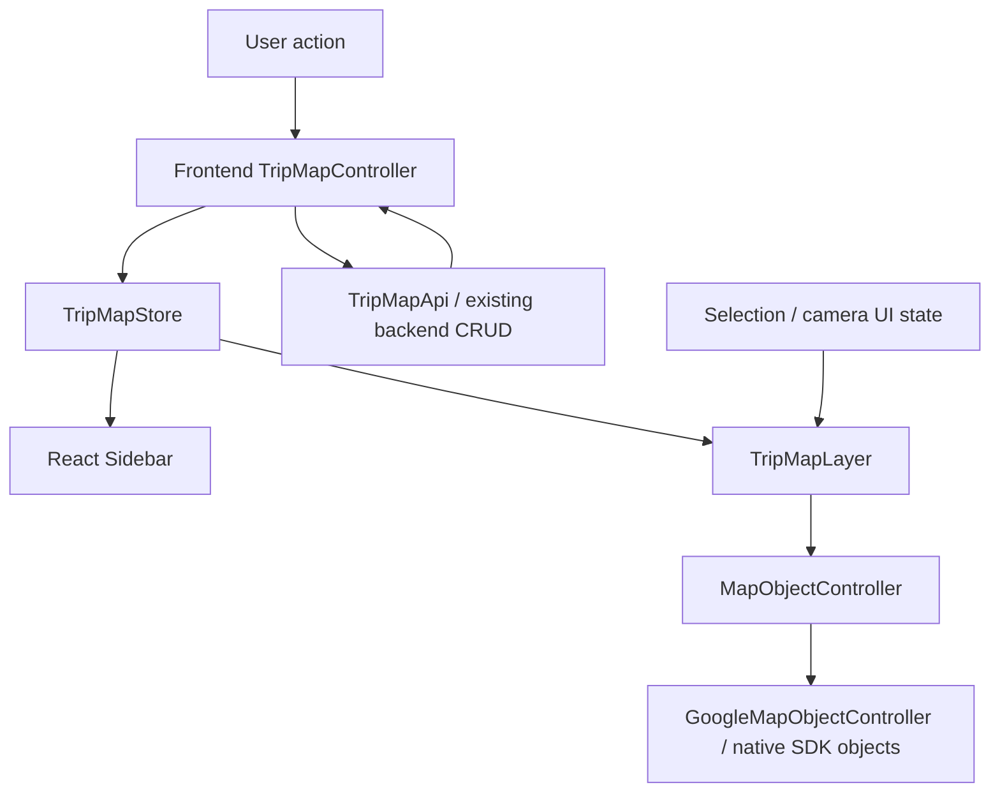

# Frontend TripMap state and rendering

## Composition and contracts

The class route root `MapPage` in `frontend/src/pages/MapPage.tsx` creates one store
and controller in its constructor and injects the stateless tripMapApi client.
Its stable context value is passed through the render-only `TripMapProvider`.
`hooks/map/useTripMap.ts` exposes the Context, `useTripMapState`
(useSyncExternalStore) and `useTripMapController`. Keeping the Context separate
from the component preserves its identity when the Provider is refreshed in development.
MapPage.componentWillUnmount cancels pending controller requests; StrictMode can
reuse the instance after cleanup. Constructors have no requests/subscriptions to leak
when StrictMode discards a construction. TripMapsWorkspace owns its catalog query
effect and MapWorkspace owns local UI; both remain function components.
No global mutable store or additional state-management dependency is introduced.

TripMapStore has getState, setState and subscribe. Snapshots contain tripMap,
visiting-order routes, status (idle/loading/ready/saving/error) and error. They are
detached and recursively frozen; getState returns a stable snapshot until publication.
The store performs no API work, domain commands or Google rendering.

The frontend TripMapController depends only on the store contract, TripMapApi and
provider-neutral domain types. Its commands are loadTrip, createTrip, deleteTrip,
closeTrip, renameTrip, addDay, addPlace, removePlace, movePlace, updatePlace and
updateMemo. movePlace takes a zero-based targetIndex matching sidebar drag/drop;
the controller normalizes stored order to one-based consecutive values per day.
The backend controller remains the canonical persistence/domain validation boundary.

## Mutation and request ordering

Commands clone the previous snapshot, apply and validate a mutation, publish it
with saving status, then call the existing PUT API. Sidebar and map update before
the response. Success replaces the snapshot with the canonical backend result.
Failure restores the previous domain and route snapshots and reports an error.
Only one mutation is in flight; mutation controls are disabled during saving and
programmatic concurrent mutation attempts return false without changing state.
Commands resolve to a success boolean; UI callbacks do not need exception handling.

New days/places use temporary frontend IDs for optimistic display. Those IDs are
omitted from the request. The backend generates canonical IDs, so only newly added
temporary objects are replaced after creation. Existing place/day IDs stay stable.
Loading another trip cancels previous work, and request identity/abort checks prevent
late responses from updating a different trip. closeTrip clears the opened snapshot.
Aborting or timing out a request does not guarantee the server canceled a write;
opening/reloading the trip fetches the canonical persisted state again.

Currently routes are straight visiting-order lines. The controller publishes updated
geometry whenever domain state changes; rollback restores the matching geometry.
TripMapLayer only renders the supplied routes and does not infer invalidation rules.
Future computed road routes need cache invalidation in the controller/backend.

## Rendering ownership

TripMapLayer accepts tripMap, routes, selection and a MapObjectController contract.
It contains no API/controller/store mutation calls or Google SDK references.
It holds marker handles keyed by place ID and polyline handles keyed by day ID.
New IDs create objects; existing IDs update through setters; missing IDs remove
their handles and click subscriptions. Layers are named itinerary-markers and
itinerary-route. Cleanup removes only its own handles, preserving unrelated layers.
Object cleanup is idempotent even if runtime disposal runs before React cleanup.

This replaces MapMarker.tsx, RoutePolyline.tsx and useMapMarker. The generic
useMapPolyline hook remains for the independent GoogleMap.polylines API. Native
Google objects are still owned by MapRuntime.objects; no domain object owns a handle.
TripMapLayer does not project screen coordinates, so panning/zoom remain SDK work.

## UI state

useMapUi owns selection and camera focus separately; sidebar collapse, AI panel
visibility remain React state. Derived view types are
read-only projections for the existing sidebar, not another editable TripMap model.
MapModel and useMapModel have been removed. LayerPanel reorder invokes the frontend
controller, and marker clicks update only selection. The former persistence
toolbar and place editor UI are removed; all controller commands remain available.

TripMapsWorkspace keeps the current map mounted while TripMapPickerDialog is open.
Without a current trip, a reusable GoogleMap supplies the
background and the picker cannot be dismissed. Opening the picker refreshes its
abortable catalog query; successful load/create closes it, failures keep it open,
and no toolbar or replacement control reopens the picker after selection.
X/Escape dismiss it only when a trip exists. The backdrop and inert background
block map/sidebar interaction.

MapToolbar is a React overlay aligned to the left of the available area beside
LayerPanel. MapViewport supplies a grid column for tools using the existing panel
width variable; the toolbar itself uses a local 16px inset and a maximum width of
720px. AI visibility changes available width, never the toolbar's left anchor.
Search keeps a local draft and reports that search is not connected yet. Undo/redo
are disabled; pan, marker, polyline, route and measure only change local selection.
It does not call APIs, controllers or Google controls. The picker remains above it.
On wide screens it reserves room for an open AI panel; at 1100px and below it hides
while AI is open, preserving its local state. Mobile placement uses the full map width.

## Manual verification

Use the real backend and /map. Verify initial picker load/create, optimistic reorder,
existing marker identity, route geometry, selection, pan/zoom,
AI panel, cleanup and remount. Temporarily disconnect the browser network to verify
rollback; reconnect and reopen to confirm persisted data. No test-only providers,
fixtures, automated test files or application branches are required.
